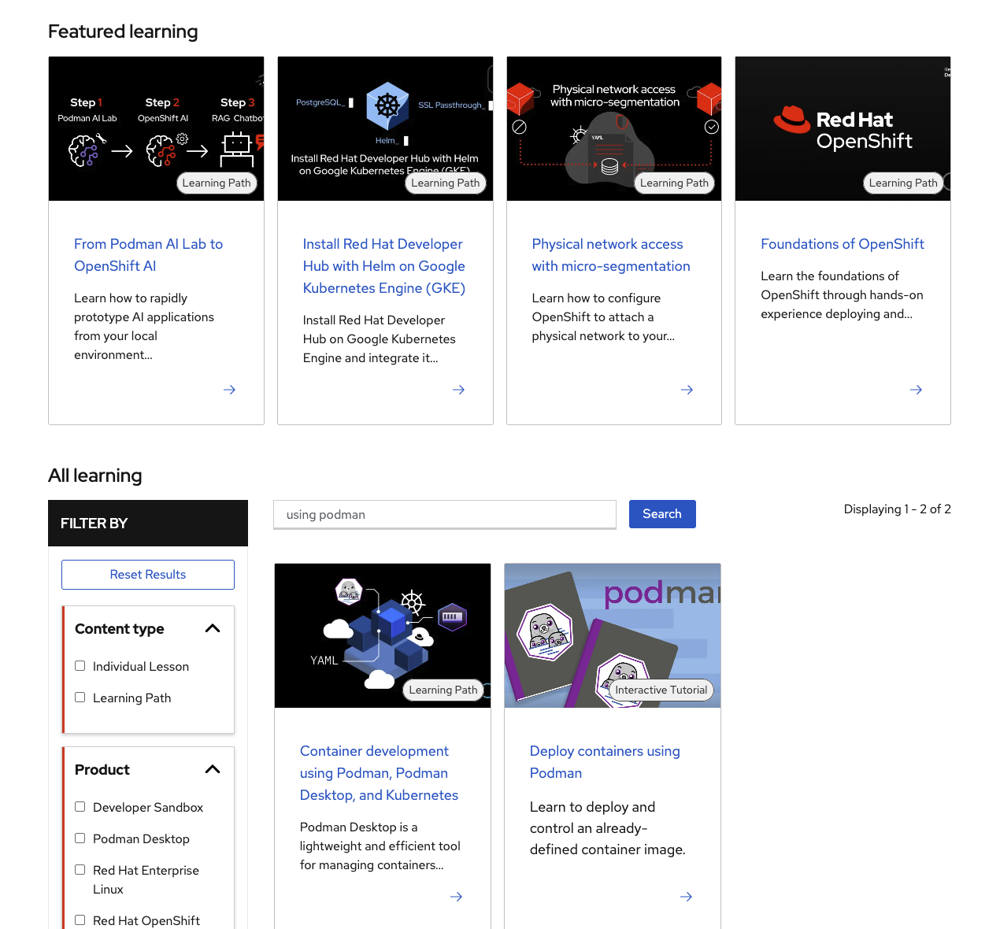
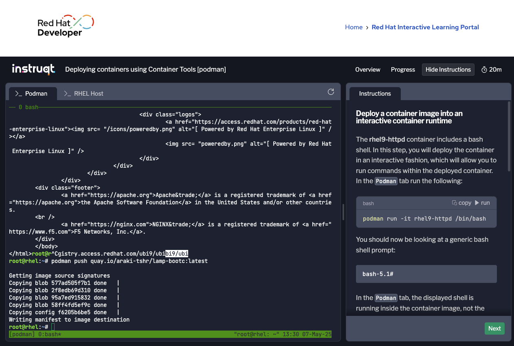
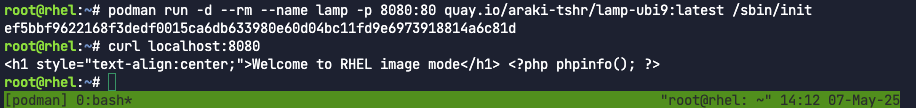
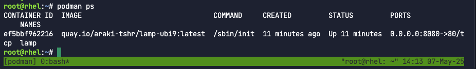
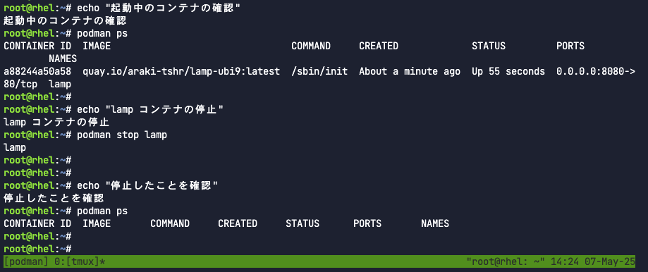
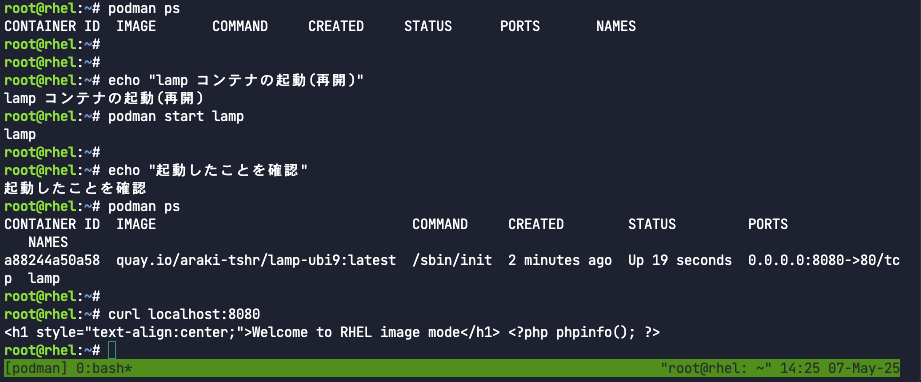
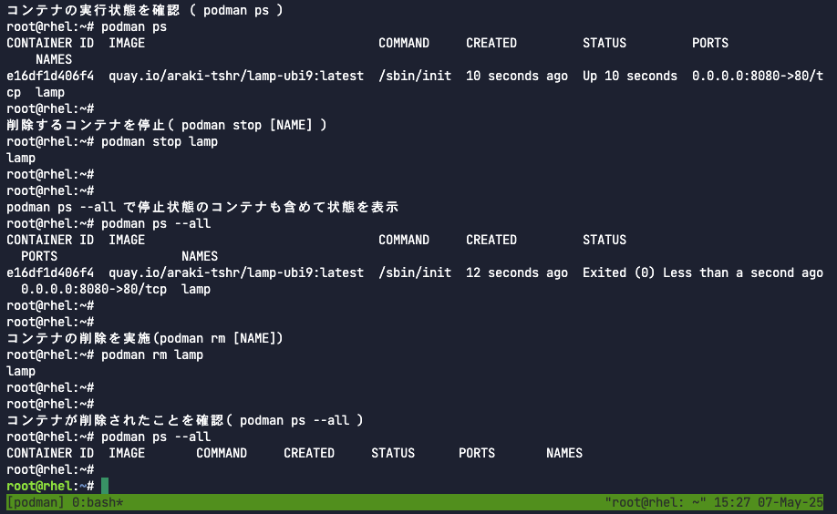
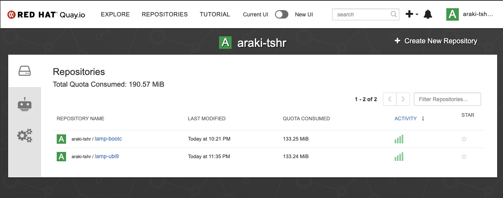
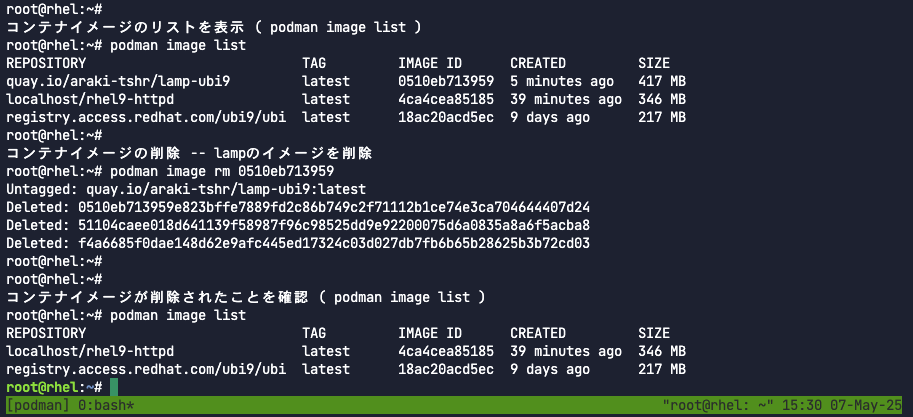

# Podman 演習

## はじめに
このコンテンツは、こちらの[オリジナル](https://developers.redhat.com/learn/rhel/rhel-image-mode-podman-command-line)から内容を抜粋して作成しました。初学者に向けて必要な内容に絞りつつ、操作内容もより手軽に実行できるようにカスタマイズしています。

## 期待する演習環境について
このコンテンツは以下のことを前提として期待しています。

* Linux / Mac / Windows いずれかのOS環境上で、Podman が実行可能であること。
  * 引用もとのdevelopers.redhat.com の"Intractive Tutolial" タイプで、Podman に関連するコースもそのまま実行環境として利用できます。
* Linux CLI の基礎知識があること
* quay.io にアカウントがあること

### Podman 環境がない場合
本来的な使用方法からは逸脱しますが、簡易的にPodmanの実行環境を得たい場合、以下のコンテンツが有効です。
[様々なRed Hat テクノロジーをハンズオンできるサイト（全編英語）：https://developers.redhat.com/learn](https://developers.redhat.com/learn)

画面中段の検索フィールドに、"using podman" とすると、"Deploy containers using Podman" というコンテンツを見つけられます。



このカタログをクリックすると、Podman の実行環境（50分で自動的に消失する）が起動します。



こちらのコンテンツ（画面の右側のセクション）には、基本的なpodman コマンドの実行について説明されて、そこで学び、Terminalセクション（画面の左側のセクション）でコマンドを実行できます。この演習と合わせてトライしてみてください。
左側のセクションは、このコンテンツ用に仮想マシンが払い出されているため、コンテンツには無い一般的な操作も行えます。ただし、50分で環境が自動的消失する点と、パブリックにある環境であることから、扱うデータ等には注意してください。また、あまりに不適切な利用と判断された場合、サービスが中止となる可能性もあるので乱用は避けてください。


# 演習：コンテナのbuild / run / stop / start / rm

## コンテナを作成する
ここでは、ContainerFile を作成し、カスタマイズされたコンテナイメージを作成する方法を体験します。

### ContainerFIle ( Dockerfile ) の作成
lampスタックを前提とした簡単なコンテナを作成します。
※lampスタックを例としていますが、アプリケーションの処理はダミー実装となっていて、RDBMSへのアクセスは行っていない点、了承ください。

#### 前準備（コンテナにコピーするファイルの用意）
以下のコマンドを実行し、index.html とsupervisord.confを用意します。それぞれのファイルは、後で実行するcontainerfileの作成や、podman build と同じ作業ディレクトリに配置してください。

index.htmlの作成
```
cat <<EOF>>index.html
<h1 style="text-align:center;">Welcome to RHEL image mode</h1> <?php phpinfo(); ?>
EOF
```

supervisordの作成
```
cat <<EOF>>supervisord.conf
[supervisord]
nodaemon=true
logfile=/var/log/supervisord.log
pidfile=/tmp/supervisord.pid

[program:httpd]
command=/usr/sbin/httpd -D FOREGROUND
autostart=true
autorestart=true
stdout_logfile=/var/log/httpd.log
stderr_logfile=/var/log/httpd.err

[program:php-fpm]
command=/usr/sbin/php-fpm --nodaemonize
autostart=true
autorestart=true
stdout_logfile=/var/log/php-fpm.log
stderr_logfile=/var/log/php-fpm.err

EOF
```

#### containerfile作成
以下のコマンドを実行し、containerfileを作成します。
ここでは、cat コマンドをヒアドキュメントでリダイレクトする方法を示していますが、直接エディタでcontainerfile を新規作成する方法でも問題ありません。

```
cat <<EOF >>containerfile

## いわゆるLAMPスタックを構築するcontainerfile

## registry.access.redhat.com　から、ubi9 のイメージを取得する
FROM registry.access.redhat.com/ubi9/ubi

## RUN命令により、取得したベースイメージ上で、dnfコマンドを実行する。
## supervisor , httpd , mariadb , mariadb-server , php-fpm , php-mysqlnd をインストール


RUN dnf module enable -y php:8.2 nginx:1.22
RUN curl -O https://dl.fedoraproject.org/pub/epel/epel-release-latest-9.noarch.rpm && \
    rpm -ivh epel-release-latest-9.noarch.rpm && \
    dnf install -y supervisor httpd mariadb mariadb-server php-fpm php-mysqlnd && \
    dnf clean all

        

# Containerfile にこの1行を追加
RUN mkdir -p /run/php-fpm

## 各種ファイルの配置
COPY index.html /var/www/html/index.html
COPY supervisord.conf /etc/supervisord.conf

CMD ["/usr/bin/supervisord", "-c", "/etc/supervisord.conf"]

EOF
```


### コンテナのビルド (build)
作成したContainerFile を使用して、podman build コマンドを実行することでコンテナをビルドすることができます。ビルドの結果、コンテナイメージが作成されます。
前のステップで作成したcontainerファイルは、"-f"オプションで指定します。
また、作成されたコンテナイメージにタグ情報を付与するため、"-t"オプションを使用します(※)。コマンド実行時は、"quay.io/[my_account]/lamp-ubi9:latest"のmy_accountを、**quay.io のユーザアカウント名 に変更したうえで** 実行してください。

※ 最終的に、quay.io (パブリックスペースのコンテナイメージレジストリサービス)に、コンテナイメージをアップロードすることを想定し、"quay.io/[my_account]/lamp-ubi9:latest" を付与しています。

```
$ podman build -f containerfile -t quay.io/[my_account]/lamp-ubi9:latest
```

## コンテナを起動する
続いて、作成したコンテナを起動します。

### コンテナの実行 (run)
コンテナの起動は以下のコマンドで行います。コマンド実行時は、"quay.io/[my_account]/lamp-ubi9:latest"のmy_accountを、**前のステップで指定した、quay.io のユーザアカウント名 に変更したうえで** 実行してください。

```
$ podman run -d --name lamp -p 8080:80 quay.io/[my_account]/lamp-ubi9:latest /sbin/init
```

#### 起動時に指定したオプションの説明
* -d : コンテナをデタッチモードで実行（バックグラウンドに起動し、新しいコンテナIDを付与）
* --name : 起動後のコンテナを識別するエリアス名を指定
* -p : ポートのマッピング (host port : container port) 今回は、podman を実行するホストの8080ポートに、コンテナの80ポートをバインドしています。
* 起動するコンテナイメージ（前ステップのビルド時に指定したタグを指定）
* コンテナ起動後に実行するコマンド

#### 起動した状態の確認

podmanを実行しているマシンのwebブラウザまたは、curlコマンドでlocalhost:8080 へアクセスします。以下は、起動した場合のcurl コマンドの実行例です。



続いて、podman ps コマンドで実行状態にあるコンテナの一覧を取得します。

```
$ podman ps
```
実行中（この画面は、ビルド時にタグ情報として、"quay.io/araki-tshr/lamp-ubi9:latest"を指定）



## コンテナの状態（実行中・停止）を操作する。(stop / start)

演習シナリオの中では、このタイミングでコンテナを停止する意味はありませんが、手段としてコンテナを停止・起動する方法を確認します。

### コンテナの停止
コンテナの停止には、podman stop コマンドを使用します。
```
$ podman stop コンテナ名(または、CONTAINER ID)
```
実行例


### コンテナの開始（再開）
停止状態のコンテナを再度起動する場合は、podman start コマンドを使用します。
```
$ podman start コンテナ名(または、CONTAINER ID)
```

実行例



## 不要となったコンテナを削除する (rm)
アプリケーションの変更等の理由で不要となったコンテナは、削除します。

### コンテナの削除
コンテナの削除には"podman rm "コマンドを使用します。尚、コンテナを削除する場合は、予めコンテナを停止しておく必要があります。

コンテナの削除
```
$ podman rm コンテナ名(または、CONTAINER ID)
```

実行例



ここまでの操作で、podman 環境でのコンテナの基本的な操作を見ることができました。

## コンテナイメージのユースケース
開発用の環境で、ビルドしたコンテナが期待通り稼働することが確認できた後、テスト用の環境へ、そしてテストが完了した後、本番環境へとイメージを取り回していくのは、環境に依存しないコンテナの特性を活かした効果的なユースケースです。コンテナイメージを異なる環境へ共有する場合、コンテナイメージレジストリを利用するのが効率的です。

### コンテナイメージのアップロード
コンテナイメージをquay.io へpush(アップロード)します。quay.io には、Red Hat Networkのアカウントでアクセスすることが可能です。（無料の１つのプライベートリポジトリプランが利用できます。）

```
$ podman login quay.io
$ podman push quay.io/[my_account]/lamp-ubi9:latest
```

コンテナのpush(アップロード)が完了すると、quay.io のリポジトリ画面よりアップロードされたイメージを確認するこができます。


### コンテナイメージのダウンロード
pushされたコンテナイメージは、podman pull コマンドで取得することが可能です。この仕組みを利用して、異なる環境でコンテナを起動したい場合は、コンテナイメージを配布することができます。

前述の手段でアップロードした場合、以下のコマンドでpull（ダウンロード）することが可能です。

```
$ podman pull quay.io/[my_account]/lamp-ubi9
```


### ローカル環境からのイメージの削除
podman build でビルドされたイメージは、podman を実行するホストのローカルストレージに保持されています。そのイメージがバージョンアップ等によって不要となったり、あるいはディスク容量の確保したい等の場合、イメージを削除します。尚、イメージを削除する場合は、該当のイメージから起動されているコンテナを停止しておく必要があります。

ホストのローカルに保持されているイメージの一覧を表示するには、podman image list コマンドを使用します。
```
$ podman image list
```

podman image rm コマンドに、削除対象のIMAGE ID を指定してイメージを削除します。
```
$ podman image rm [IMAGE ID]
```

実行例


以上で、contianerファイルを用いた、コンテナのbuild / run / stop / start / rm の演習を終了します。